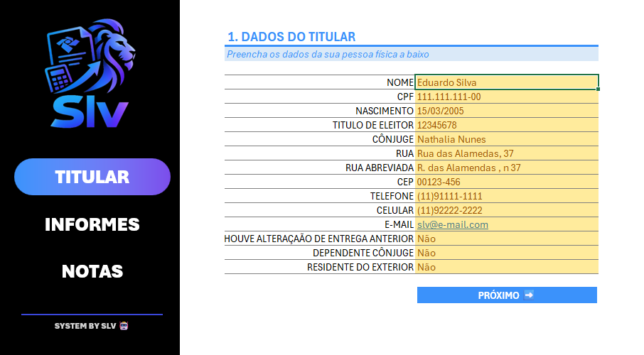
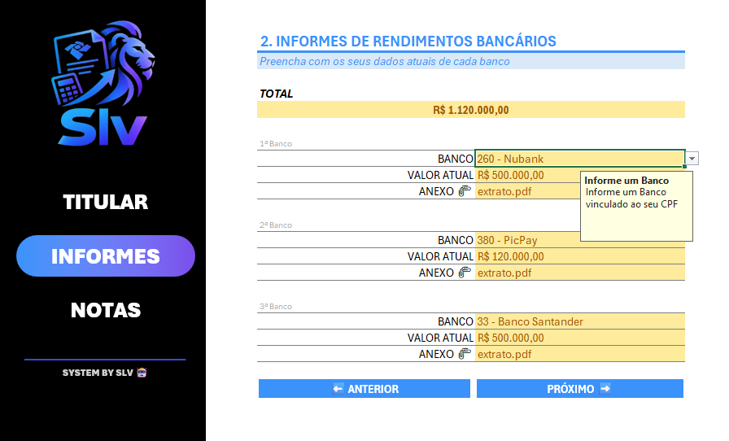
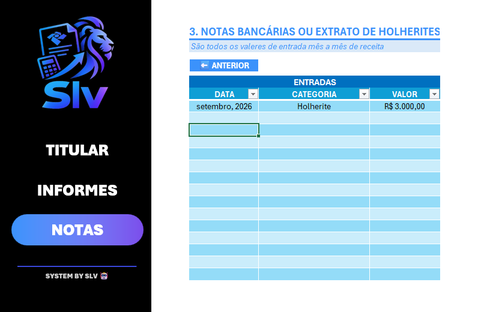

# 🧾 SLV Imposto de Renda - Organizador

<div align="center">


### Organizador de informações para a Declaração do Imposto de Renda

</div>

---

## 📌 Sobre o Projeto

O **SLV Imposto de Renda - Organizador** é uma ferramenta desenvolvida em **Microsoft Excel** com o objetivo de auxiliar na organização e centralização de informações relacionadas à declaração do Imposto de Renda.

A ferramenta foi desenvolvida com uma interface simples e intuitiva, permitindo que diferentes informações sejam registradas e organizadas em um único local.

O projeto utiliza recursos do Excel como **validação de dados, fórmulas, organização de informações, menus de navegação e elementos visuais**, buscando proporcionar uma experiência mais prática durante o preenchimento.

---

## 🎯 Objetivo

O principal objetivo do projeto é criar uma ferramenta que facilite o processo de organização das informações que podem ser necessárias durante a preparação da declaração do Imposto de Renda.

A solução busca:

- 📋 Centralizar informações importantes;
- 🗂️ Organizar os dados de forma estruturada;
- ✅ Utilizar validações para auxiliar no preenchimento;
- 🔗 Facilitar a navegação entre as áreas da planilha;
- 📊 Tornar a consulta das informações mais prática;
- 💻 Aplicar conhecimentos de Excel em um projeto prático;
- 📚 Documentar o desenvolvimento utilizando GitHub.

---

# 🚀 Como utilizar

A ferramenta foi estruturada para que o usuário possa seguir um fluxo simples de preenchimento.

## 1️⃣ Acessando o Menu

Ao abrir a planilha, o usuário encontra o **Menu Principal**, que funciona como ponto de navegação para as diferentes áreas do projeto.

Por meio do menu, é possível acessar as áreas disponíveis na ferramenta sem a necessidade de procurar manualmente cada seção da planilha.

### Menu Principal


---

## 2️⃣ Preenchendo os Dados do Titular

O primeiro passo é preencher as informações relacionadas ao **titular**.

Nesta etapa, devem ser inseridas as informações solicitadas pela ferramenta, mantendo os dados organizados e preenchidos corretamente.

A área foi estruturada para facilitar a identificação das informações e tornar o preenchimento mais intuitivo.

### Dados do Titular



---

## 3️⃣ Registrando os Informes de Rendimentos

Após o preenchimento dos dados do titular, o usuário pode registrar as informações relacionadas aos **Informes de Rendimentos**.

Essa etapa permite centralizar as informações recebidas das fontes pagadoras, facilitando posteriormente a consulta e organização dos dados.

### Informes de Rendimentos



---

## 4️⃣ Registrando as Notas Bancárias

A ferramenta também possui uma área destinada ao registro e organização das **Notas Bancárias**.

O objetivo dessa etapa é manter as informações organizadas dentro da própria ferramenta, facilitando a consulta dos dados posteriormente.

### Notas Bancárias



---

## 5️⃣ Conferindo as informações

Após realizar os preenchimentos, recomenda-se revisar as informações cadastradas.

A conferência permite identificar possíveis erros de preenchimento e verificar se os dados necessários foram registrados corretamente.

O menu de navegação pode ser utilizado para retornar às diferentes áreas da ferramenta sempre que necessário.

---

# ⚙️ Funcionalidades

Entre os principais recursos presentes no projeto estão:

- 🏠 Menu de navegação;
- 👤 Cadastro de informações do titular;
- 💰 Organização de informes de rendimentos;
- 🏦 Organização de informações bancárias;
- ✅ Validação de dados;
- 🔗 Links e atalhos de navegação;
- 📊 Estruturação e organização das informações;
- 🎨 Interface personalizada;
- 📋 Centralização das informações em uma única ferramenta.

---

# 🛠️ Tecnologias e Recursos

O projeto foi desenvolvido utilizando:

- **Microsoft Excel**
- Fórmulas e funções;
- Validação de dados;
- Formatação de células;
- Formatação condicional;
- Hiperlinks;
- Menus de navegação;
- Organização de tabelas;
- Recursos de interface e formatação visual.

---

# 📂 Estrutura do Repositório

```text
SLV-Imposto-de-Renda-Organizador/
│
├── 📁 images/
│   ├── Dados_Titular.png
│   ├── Informes_Rendimento.png
│   ├── Menu.png
│   ├── Notas_Bancarias.png
│   └── Slv_Imp_Renda_Logo.png
│
├── 📊 Slv_Imposto_de_Renda.xlsx
│
└── 📄 README.md
